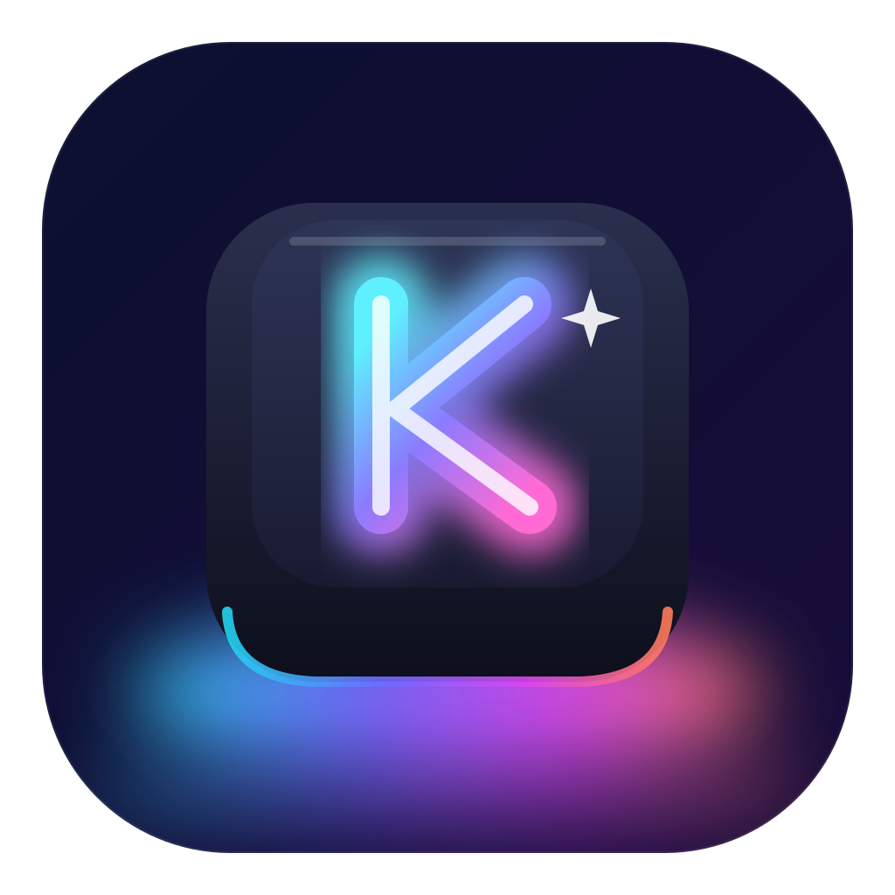
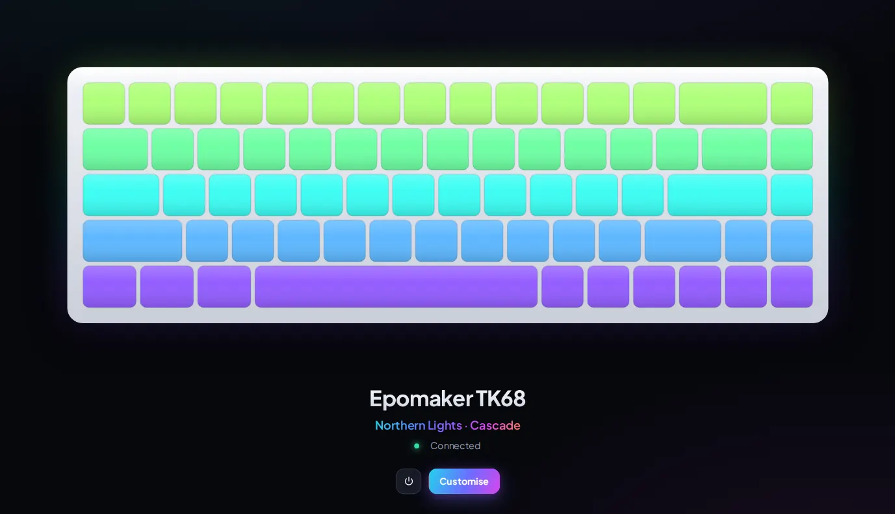
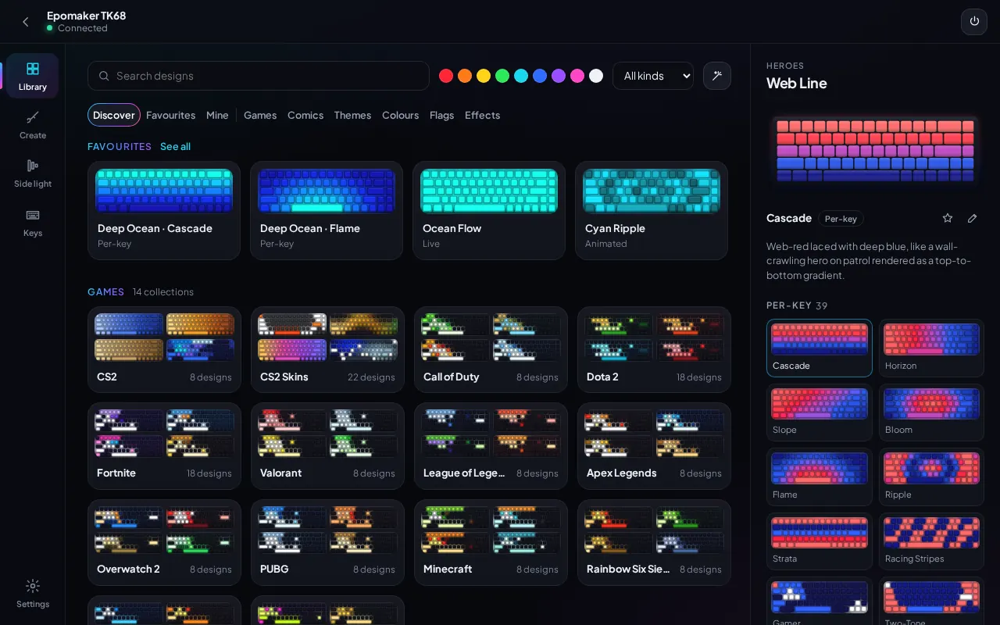
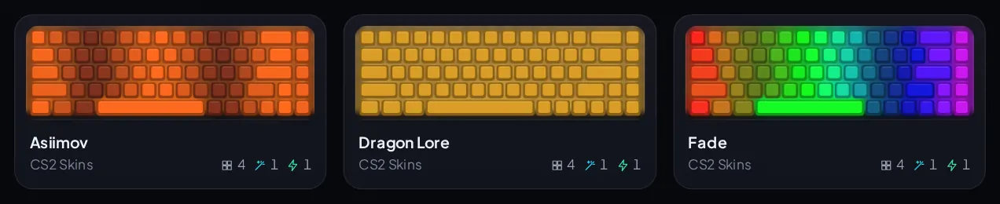
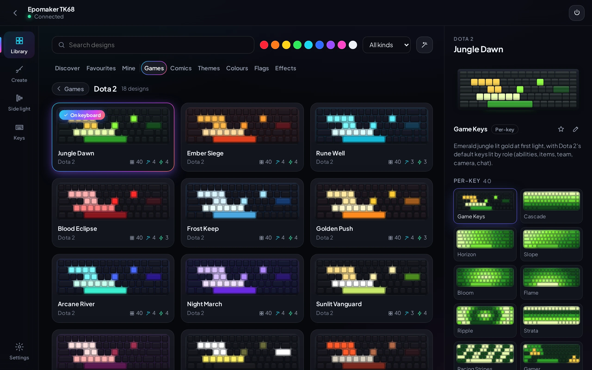
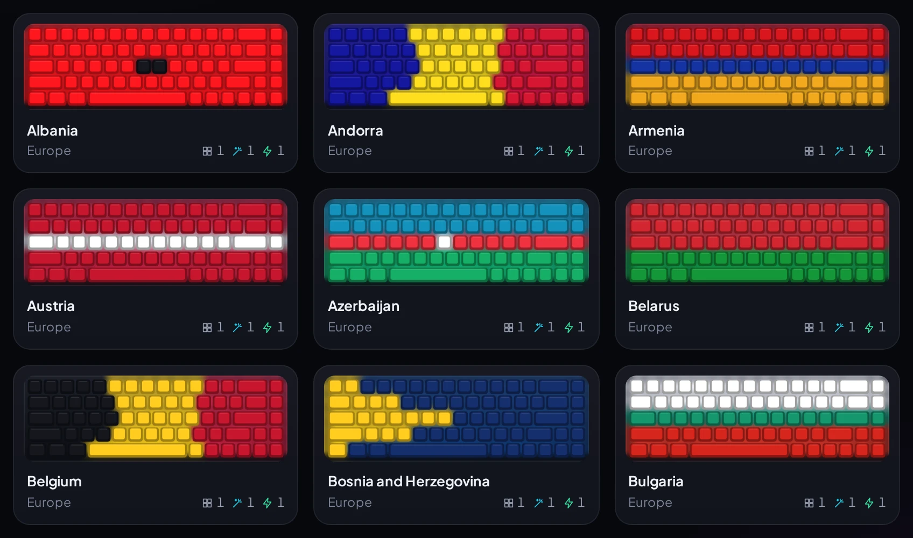
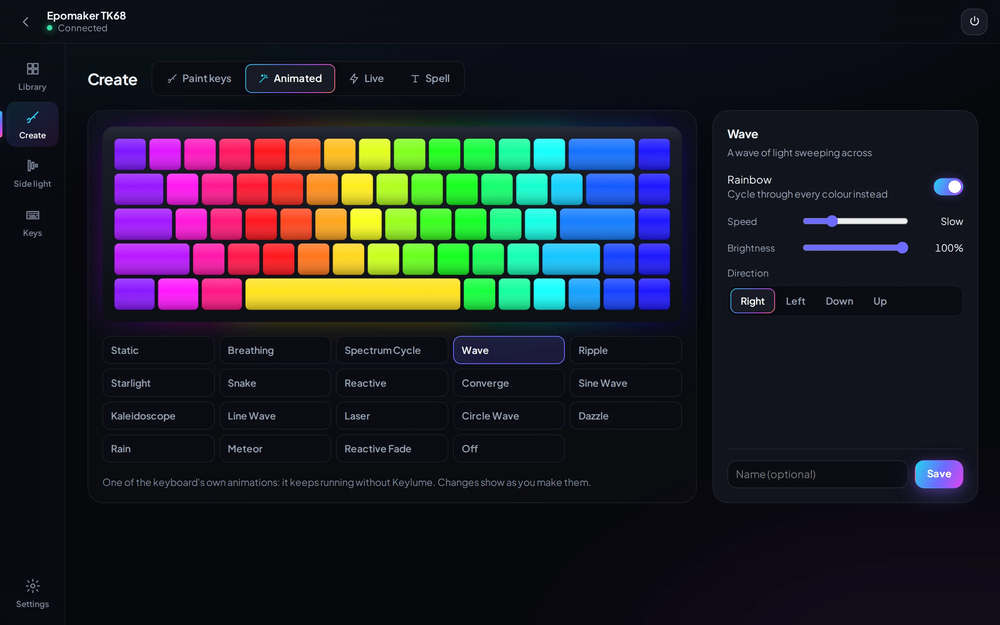

<div align="center">



# Keylume

**Lighting and key control for RGB keyboards, without the vendor software.**

[](https://github.com/headless-start/keylume/actions/workflows/ci.yml)
[](https://github.com/headless-start/keylume/releases/latest)

[](LICENSE)



**About 1,400 designs · per-key lighting · the keyboard's own animations · live effects · key remapping · shareable design packs · nothing leaves your PC**

[**Download for Windows and Linux**](https://github.com/headless-start/keylume/releases/latest) · free, no account

</div>

Keylume is a desktop app for the lighting and keys of an RGB mechanical keyboard. Open it
and your keyboard is on screen, lit exactly as it is; click it to pick a design, make your
own, remap keys or change the keyboard's settings. Everything runs on your PC: no account,
no cloud, no telemetry.



## Why it exists

The Epomaker TK68 is a good 65 % keyboard with per-key RGB, but everything it can do was
locked inside the maker's driver app: a fixed set of the firmware's built-in effects, a
per-key colour editor, and nothing more. No library of designs, no way to share one, no
effects beyond what the firmware ships with, and no documented way for any other program to
talk to the keyboard.

Keylume started as the way out. The keyboard's USB protocol was worked out clean-room, by
watching what the vendor app sends and testing each command against the keyboard, and it's
written up in [docs/PROTOCOL.md](docs/PROTOCOL.md). With the protocol open, the rest could be
built properly: a large free catalogue, effects the firmware can't do on its own, designs
that can be saved and shared, and an app that describes keyboards as data, so the TK68 is
the first board rather than the only one.

## What you can do

### Pick from a library made for your keyboard

Games (each on its default keys, lit by role), comics, myths, nature, cities, colours,
194 flags and effects: about 1,400 designs in more than 31,000 looks, all redrawn for the
shape of the keyboard that's plugged in. Search by word or colour, keep favourites, or let it
surprise you. Point at a design and it plays; click it and it's on the keyboard.



<table>
<tr>
<td width="50%"></td>
<td width="50%"></td>
</tr>
<tr>
<td align="center">Games, on their default keys</td>
<td align="center">Flags of the world</td>
</tr>
</table>

### Make your own

Paint keys, tune the keyboard's own animations (eighteen of them, from waves to kaleidoscopes),
build live effects that follow your music, the screen's colour or a timer, or spell words
across the keys. What you change is on the keyboard at once.



### And the rest

- **Keys.** Remap any key on the three onboard profiles and the Fn layer, and record
  macros. On 60 and 65 % boards, Fn + the number row gives F1 … F12. Changes are stored on
  the keyboard, so they work on any computer.
- **Keyboard settings.** Polling rate, debounce, sleep timers, Windows-key lock, WASD swap,
  onboard profiles, and a full backup and restore of the keyboard.
- **Design packs.** A `.keylumepack` file holds themes and hand-made designs, signed with
  the maker's key: give it away, or sell it.
- **True colours.** Colours are corrected for how LEDs emit light, so orange, pink and
  pastels come out close to what's on screen.

The clips come from the app itself, running against its simulated keyboard
(`tools/readme_shots.mjs` films them).

## Tech stack

| Layer | Built with |
|---|---|
| Keyboard protocols and device I/O | Rust, a workspace of six crates; `hidapi` for USB HID feature reports |
| Desktop app | Tauri 2: tray, global shortcuts, autostart, single instance; WebView2 on Windows, WebKitGTK on Linux |
| Interface | React 18, TypeScript, Vite, Zustand |
| Live effects | `rustfft` for the audio spectrum, `cpal` for system-audio loopback, GDI screen sampling, `sysinfo` for CPU load |
| Design packs | Ed25519 signatures (`ed25519-dalek`) over canonical JSON |
| Testing | `cargo test` against firmware simulators, Vitest and Testing Library, clippy with `-D warnings` |
| Delivery | GitHub Actions on Linux and Windows builds the NSIS installer, `.deb` and AppImage with SHA-256 checksums; `cargo-xwin` cross-builds the Windows app from Linux |

## How it works

```
crates/
  keylume-proto     wire protocols (Rongyuan, HID LampArray) and keyboard layouts; pure, no I/O
  keylume-device    HID transport with the firmware's timing rules, identity checks, simulators
  keylume-profiles  the generated design library: palettes × patterns, themes, flags, effects
  keylume-live      real-time animators (they also render the app's previews)
  keylume-core      the device service, colour correction, settings, packs, backups
  keylume-cli       command-line control and diagnostics
src-tauri/          desktop shell: commands, tray, hotkeys, installer
src/                React + TypeScript interface
boards/, layouts/   keyboards described as data
```

A few of the problems it solves:

- **A firmware that punishes haste.** The TK68 needs about 1.1 s after a settings write and
  about 1.5 s to commit a picture to flash; commands sent sooner wedge its config channel.
  One device worker owns the keyboard: it coalesces requests (only the latest choice is
  written), paces writes to the measured timings and recovers a stalled channel. Animation
  runs in the firmware's effects or its real-time channels, never by rewriting flash in a loop.
- **Honest state.** The app shows what the keyboard confirmed, not what was clicked: every
  request carries an id, pictures and key maps are read back where the keyboard allows it,
  and a write that didn't stick is reported.
- **Safe writes.** The TK68 reports the USB ids of an Apple keyboard, so Keylume checks the
  product strings and the HID report descriptor before it writes anything, and validates a
  backup in full before a restore touches the keyboard.
- **Tested without hardware.** A firmware simulator reproduces the timing rules and the
  failures (a wedged channel, unplugging, refused writes). More than 250 Rust and UI tests
  run on every push, on Linux and Windows.
- **A catalogue that is data.** Designs are generated from palettes, patterns and JSON theme
  files and redrawn for each layout; tests reject duplicates and near-dark designs, and the
  theme checker refuses brand names.

## Supported keyboards

| Keyboard | Status |
|---|---|
| Epomaker TK68, wired USB (Rongyuan firmware 3.04) | Supported, verified on hardware |
| Keyboards with **HID LampArray** (Windows Dynamic Lighting) | Experimental: built to the standard, not yet tried on one |
| Other Rongyuan "yc300" boards (Epomaker EP108, Skyline 87, TH-21, TH96, …) | Same protocol; each needs a board file and an owner to verify it |

[docs/DEVICES.md](docs/DEVICES.md) explains how a keyboard is described and how to add one.
No keyboard at hand? **Settings → Demo keyboard** runs the whole app against a simulated
TK68 or a full-size keyboard.

## Install

Download the latest release from the [Releases](https://github.com/headless-start/keylume/releases/latest) page.

- **Windows 10 / 11:** run `Keylume_<version>_x64-setup.exe`. It installs for your user
  only, without administrator rights. The installer isn't code-signed yet, so SmartScreen
  may warn; check it against `SHA256SUMS.txt` (`certutil -hashfile <file> SHA256`).
- **Linux:** the `.deb` (which adds the udev rule for the TK68) or the AppImage. The music
  and screen effects are Windows-only for now.

Close the maker's app first: only one program can use the keyboard at a time. If it starts
anyway, Keylume pauses, offers to close it, and carries on.

## Build from source

Rust (stable), Node.js 22 and the [Tauri 2 prerequisites](https://v2.tauri.app/start/prerequisites/)
for your platform.

```bash
npm ci && npm run build
cargo test --workspace && npm test   # no keyboard needed: everything runs against simulators
npm run dev                          # the UI in a browser, with a simulated keyboard
npx tauri build                      # the desktop app for this platform
```

[CONTRIBUTING.md](CONTRIBUTING.md) has the full setup, and [docs/RELEASING.md](docs/RELEASING.md)
the Windows cross-build.

| Docs | |
|---|---|
| [PROTOCOL.md](docs/PROTOCOL.md) | the TK68 protocol and its timing |
| [DEVICES.md](docs/DEVICES.md) | keyboards as data, and adding one |
| [DESIGN.md](docs/DESIGN.md) | the interface: layout, components, motion |
| [PROFILES.md](docs/PROFILES.md) | the design file format |
| [PACKS.md](docs/PACKS.md) | design packs: making, signing, the file format |
| [FIRMWARE.md](docs/FIRMWARE.md) | research towards the keyboard's firmware |
| [ROADMAP.md](docs/ROADMAP.md) | what's next |

## Privacy

Keylume never connects to the internet: no account, no cloud, no telemetry, no update
checks, and no link to any game or game store. Settings and designs stay in your user data
folder. System audio, CPU load and the screen's average colour are read only while an
effect that uses them runs, and are never stored.

## Contributing

Designs, keyboards and fixes are welcome. Changes land through pull requests into `main`;
[CONTRIBUTING.md](CONTRIBUTING.md) covers the setup, the code layout and the checks, and
security issues go through [SECURITY.md](SECURITY.md).

## Licence

[MIT](LICENSE). Built by [Ayush Tiwari](https://github.com/headless-start). Keylume is an
independent project, not affiliated with Epomaker, Rongyuan or any game publisher; game
names only say which game a design is made for.
